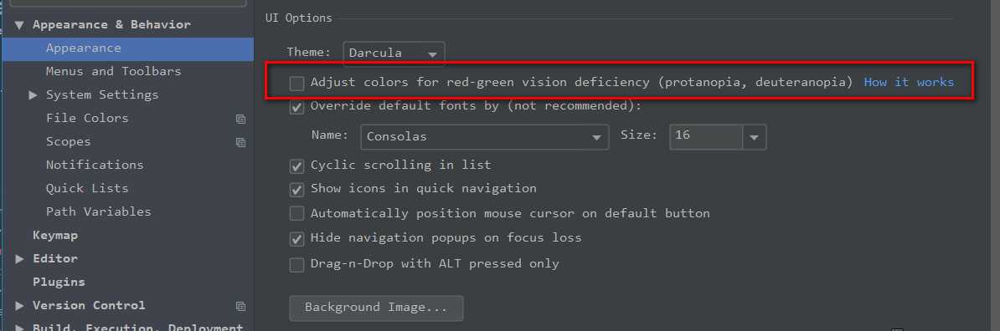

#### 主题设置
settings>>>appearance>>>theme/font：修改主题

#### 插件安装
支持springboot：
settings>>>plugin>>>>搜索Spring Assistant

#### 使用问题
##### 1. 无法创建java class文件
File——>Project Structure——>Project Settings——>Modules：
选择该项目的java存放的文件夹，将其设置为源文件，点击OK,apply即可

##### 2. 代码提示忽略大小写
setting->Editor->General->Code Completion

##### 3. 重写lei0的实现方法
alt+insert

### 快捷键问题
 - try/catch: ctrl+alt+t
 
 
### 问题
#### 1. darcula主题背景字体颜色无法修改，为蓝色
排查了好几天，发现一个配置项：

仔细看这段文件可以发现，这个配置是专门为红绿色盲者提供的选项，当把这个选项勾选后，默认会将主题的背景字体调整为蓝色.----比较人性化的设计。

